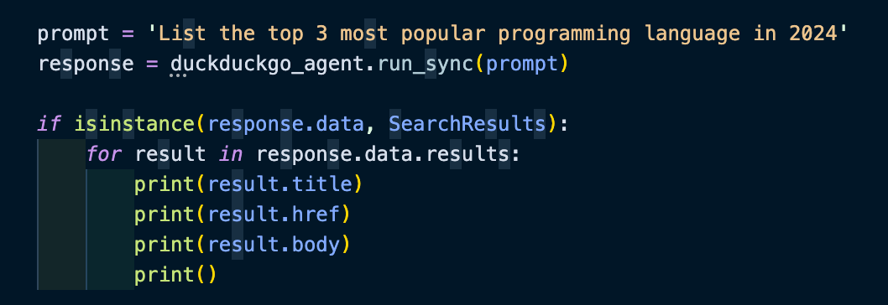
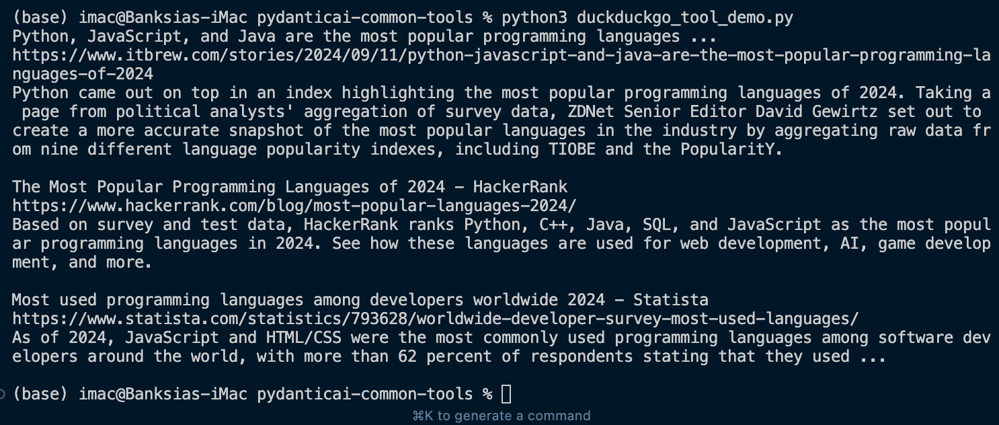

# PydanticAI Common Tools Demo 🌸





## Overview 📝

This repository demonstrates the usage of PydanticAI's newly released Common Tools feature. The implementation showcases how to integrate DuckDuckGo search capabilities using PydanticAI's built-in tools.

## Features 🚀

- DuckDuckGo search integration
- Structured search results using Pydantic models
- Asynchronous API support
- Environment variable configuration

## Installation 📦

```bash
# Create and activate virtual environment
python -m venv venv
source venv/bin/activate  # On Windows: venv\Scripts\activate

# Install dependencies
pip install pydantic-ai
pip install 'pydantic-ai-slim[duckduckgo]'
pip install python-dotenv
pip install 'pydantic-ai-slim[tavily]'
```

## Environment Setup

Create a `.env` file in your project root:

```env
OPENAI_API_KEY=""
TAVILY_API_KEY=""
```

## Usage

```python
from dotenv import load_dotenv
from pydantic_ai.agent import Agent
from pydantic_ai.models.openai import OpenAIModel
from pydantic_ai.common_tools.duckduckgo import duckduckgo_search_tool

# Load environment variables
load_dotenv()

# Initialize the agent
agent = Agent(
    name='DuckDuckGo Search Agent',
    model=OpenAIModel('gpt-4'),
    tools=[duckduckgo_search_tool()],
    system_prompt='Use DuckDuckGo search for any giving query and return the results.'
)
```

## Credits 🙏🏻

- Tutorial inspiration: [Jie Jenn](https://www.youtube.com/watch?v=TZ9q79WB3hc)
- PydanticAI Common Tools: [Documentation](https://ai.pydantic.dev/)
- [Tavily](https://tavily.com/)

## License 📝

MIT

---
*Note: This project is for demonstration purposes and is not affiliated with PydanticAI or DuckDuckGo.* 